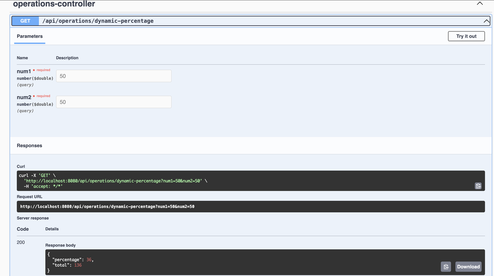
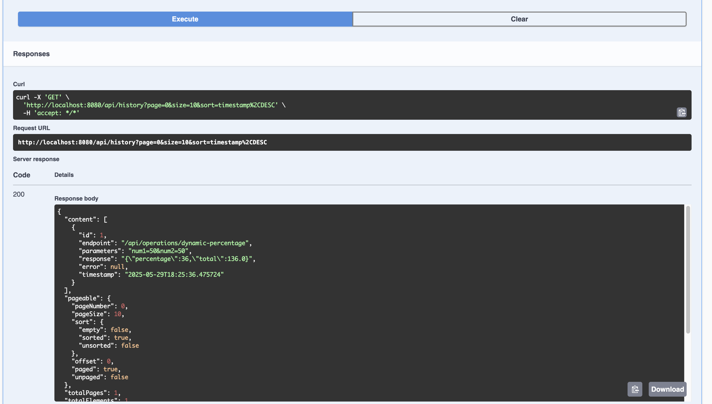

# Tenpo Call History API

API REST para guardar y consultar el historial de llamadas a endpoints, desarrollada con **Spring Boot 3**, **Java 21**, **PostgreSQL**, y **Docker**.

---

## 🧰 Requisitos mínimos

Asegúrate de tener lo siguiente instalado:

- [Docker](https://docs.docker.com/get-docker/)
- [Docker Compose](https://docs.docker.com/compose/)
- [Java 21 (JDK)](https://jdk.java.net/21/) *(solo si deseas compilar localmente sin Docker)*
- [Gradle](https://gradle.org/install/) *(opcional si usas `./gradlew`)*

---

## 🚀 Cómo ejecutar el proyecto

1. **Clona el repositorio**
   ```bash
   git clone https://github.com/ojacome/call-history.git
   cd call-history
   ```


2. **Compila ej jar** (No necesario, Ya se encuentra el jar)
   ```bash
   ./gradlew clean build
    ```

3. **Levanta la app con Docker** 
   ```bash
   docker-compose up --build
    ```

4. **Documentacion** 

Swagger UI (si configurado): http://localhost:8080/swagger-ui.html


## ⚙️ Variables de entorno (ya configuradas en docker-compose.yml)

| Variable                     | Valor                                      |
| ---------------------------- | ------------------------------------------ |
| SPRING\_DATASOURCE\_URL      | jdbc\:postgresql://postgres:5432/db\_tenpo |
| SPRING\_DATASOURCE\_USERNAME | ojacome                                    |
| SPRING\_DATASOURCE\_PASSWORD | 12345678                                   |

## 🧪 Pruebas
```bash
   ./gradlew test
```

- Cálculo con porcentaje dinámico



- Historial de llamadas

